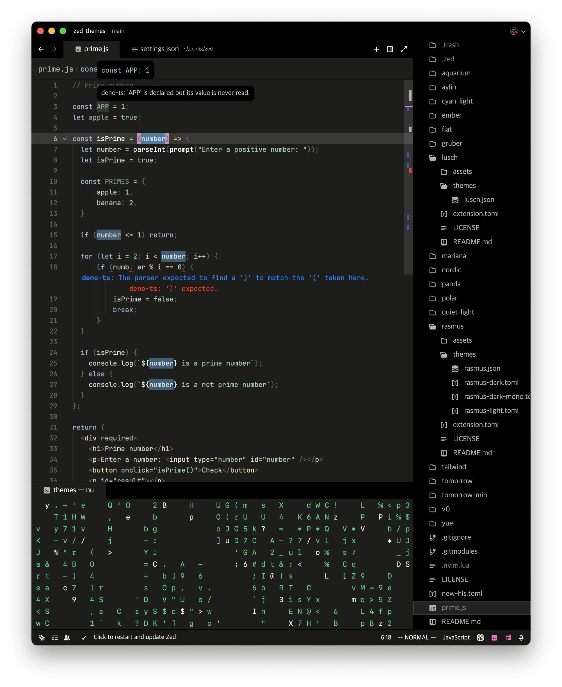
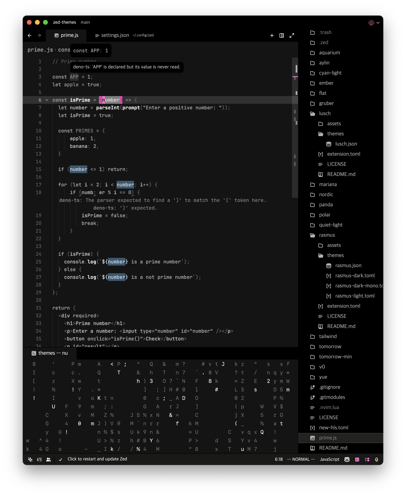

# Rasmus
`variants: [Bright, Dark, Dark Mono]`
Rasmus theme for Zed inspired by [rsms sublime theme](https://github.com/rsms/sublime-theme)

## Preview
### Rasmus Dark

### Rasmus Dark Mono

### Rasmus Bright

## Installation
1. Copy rasmus.json to ~/.config/zed/themes/
2. Open Zed and navigate to Settings -> Theme -> Rasmus
